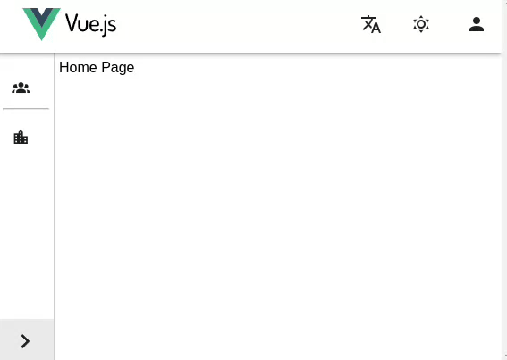

# Sidebar Menu Vue

Collapsible sidebar menu using Vue.

## Installation

1. Install with npm

```bash
  cd menu-vue
  npm i
```

2. Run with npm

```bash
  npm run dev
```

## Demo



## Roadmap

-   Add translation

-   Add dark mode
